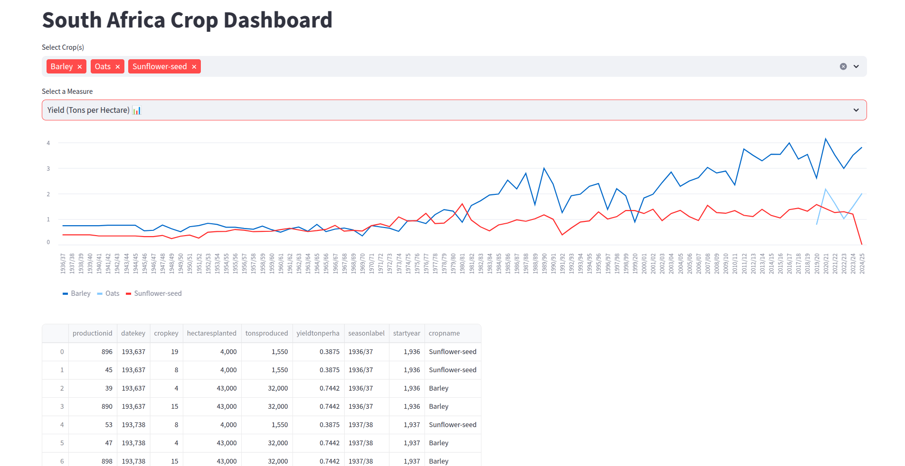

# Excel Crops Stats Scraping and Visualization

This project involves scraping crop statistics from an Excel file, storing the data in a PostgreSQL database, and visualizing it using Streamlit. Key tools used include Python, PostgreSQL, Pandas, and Streamlit.




## Project Workflow

1. **Scrape Excel Data:** Use Python and Pandas to read and preprocess the crop statistics data.
2. **Store Data in PostgreSQL:** Insert the processed data into the PostgreSQL database.
3. **Visualize Data:** Use Streamlit to create interactive dashboards for exploring:
   - Production trends
   - Yield comparisons
   - Historical analysis of planted areas

## Prerequisites

- Docker installed on your machine
- Python 3.12.3+ installed


## Setup Guide

### Step 1: Run PostgreSQL Container
Start a PostgreSQL database using Docker:

```bash
docker pull postgres

docker run --name postgres -e POSTGRES_PASSWORD=bigdata -d -p 5432:5432 postgres
```

This will run a PostgreSQL container with:
- **Username:** `postgres` (default)
- **Password:** `bigdata`
- **Port:** `5432`

### Step 2: Setup Python Virtual Environment
Create and activate a Python virtual environment:

```bash
# Create virtual environment
python -m venv venv

# Activate virtual environment
# On Windows
venv\Scripts\activate

# On macOS/Linux
source venv/bin/activate
```

### Step 3: Install Required Python Packages
Inside the virtual environment, install the project dependencies:

```bash
pip install -r requirements.txt
```

The `requirements.txt` file contains the necessary libraries for the project (e.g., Pandas, Streamlit).

### Step 4: Run the Streamlit Application
Start the Streamlit app to visualize the crop data:

```bash
streamlit run src/app.py
```